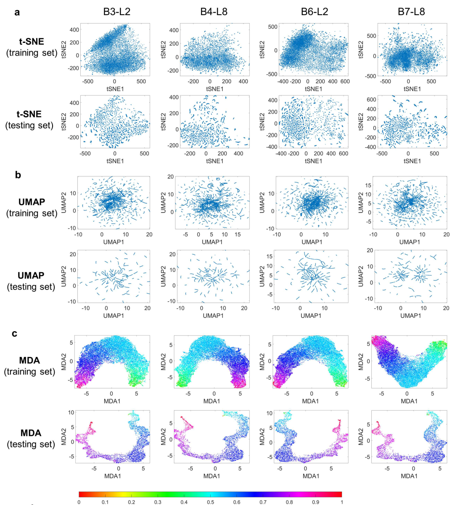

# Manifold discovery and analysis

This code implements the  manifold discovery and analysis (MDA) algorithm presented in "Revealing Hidden Patterns in Deep Neural Network Feature Space Continuum via Manifold Learning, in press, Nature Communications, 2023".
Please run demo_MDA.ipynb for analyzing deep learning features for five different tasks (medical image segmentation and superresolution, gene expression prediction, survival prediction, and COVID-19 x-ray image classification). You can also run our reproducible codes in Code Ocean (https://doi.org/10.24433/CO.0076930.v1). 

# Required packages

scikit-learn, scipy, tensorflow, umap-learn, pandas, matplotlib, jupyter, jupyterlab and mat73. The tested package versions are: jupyter (1.0.0),jupyterlab (3.6.1), mat73 (0.62), matplotlib (3.4.1), pandas (1.2.4), scikit-learn (0.24.2), scipy (1.6.1), tensorflow (2.5.1), umap-learn (0.5.3)

# Data

The analyzed data can be downloaded from https://drive.google.com/drive/folders/1MUvngB04qd1XU6oFV_aJwSaScj0KP2c3?usp=sharing.

# Motivation

Deep neural networks (DNNs) extract thousands to millions of task-specific features during model training for inference and decision-making. While visualizing these features is critical for comprehending the learning process and improving the performance of the DNNs, existing visualization techniques work only for classification tasks. For regressions, the feature points lie on a high dimensional continuum having an inherently complex shape, making a meaningful visualization of the features intractable. Given that the majority of deep learning applications are regression-oriented, developing a conceptual framework and computational method to reliably visualize the regression features is of great significance. Here, we introduce a manifold discovery and analysis (MDA) method for DNN feature visualization, which involves learning the manifold topology associated with the output and target labels of a DNN. MDA leverages the acquired topological information to preserve the local geometry of the feature space manifold and provides insightful visualizations of the DNN features, highlighting the appropriateness, generalizability, and adversarial robustness of a DNN. The performance and advantages of the MDA approach compared to the existing methods are demonstrated in different deep learning applications.

# Visualization and analysis of Dense-UNet features for image segmentation task:

Figure 1. Visualization and analysis of Dense-UNet features for segmentation task after training the network. Here, B3-L2 denotes the 2nd layer of the 3rd dense block, B4-L8 denotes the 8th layer of the 4th dense block, B6-L2 denotes the 2nd layer of the 6th dense block, and B7-L8 denotes the last layer before the final output. t-SNE, UMAP and MDA results are shown in (a), (b), (c), respectively for training and testing datasets at different network layers. The colorbar denotes the normalized manifold distance. (d) Pearson correlations between the geodesic distances among feature data points in HD and low dimensional representation from different methods are shown for training and testing data. 
